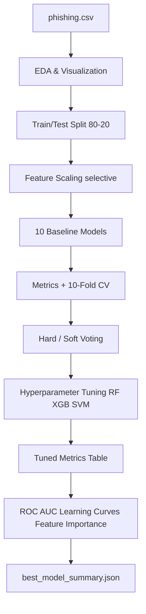

# Phishing Website Detection Using Machine Learning

[](https://www.python.org/)
[](LICENSE)
[](https://scikit-learn.org/)
[](https://xgboost.readthedocs.io/)

A **comparative machine learning framework** for detecting phishing websites from URL- and page-structure-based features. The project is designed for **thesis work**, **journal publication**, and **reproducible research**, with a publication-ready Jupyter notebook that covers exploratory analysis, baseline benchmarking, hyperparameter optimization, ensemble learning, and professional evaluation visuals.

---

## Table of Contents

- [Overview](#overview)
- [Research Gap & Contribution](#research-gap--contribution)
- [Problem Statement & Objectives](#problem-statement--objectives)
- [Key Features](#key-features)
- [Methodology](#methodology)
- [Dataset](#dataset)
- [Machine Learning Pipeline](#machine-learning-pipeline)
- [Models Used](#models-used)
- [Hyperparameter Tuning](#hyperparameter-tuning)
- [Evaluation Metrics](#evaluation-metrics)
- [Visualizations](#visualizations)
- [Results Summary](#results-summary)
- [Project Structure](#project-structure)
- [Requirements](#requirements)
- [Installation](#installation)
- [Usage Guide](#usage-guide)
- [Notebook Sections](#notebook-sections)
- [Output Files](#output-files)
- [References & Related Literature](#references--related-literature)
- [Troubleshooting](#troubleshooting)
- [Future Work](#future-work)
- [Citation](#citation)
- [License](#license)
- [Author](#author)

---

## Overview

Phishing attacks remain one of the most common and damaging cybersecurity threats. Attackers create fraudulent websites that mimic legitimate services to steal credentials, payment data, and personal information. Traditional rule-based or blacklist approaches often **fail to generalize** when attackers use new domains, URL obfuscation, or rapidly changing page structures.

This repository implements an end-to-end **machine learning-based detection system** that:

1. Loads and explores a structured phishing URL feature dataset.
2. Trains and compares **10 classical ML algorithms**.
3. Applies **10-fold cross-validation** for stability analysis.
4. Builds **hard** and **soft** voting ensemble classifiers.
5. Performs **hyperparameter tuning** on Random Forest, XGBoost, and SVM.
6. Produces **publication-quality plots** (ROC with AUC, learning curves, feature importance, optional SHAP).
7. Exports a machine-readable **`best_model_summary.json`** for thesis conclusions.

The main artifact is:

`Phishing_Website_Detection_Using_Machine_Learning_New.ipynb`

---

## Research Gap & Contribution

### Research Gap

Traditional phishing detection systems often:

- Rely on static blacklists that cannot catch zero-day phishing URLs.
- Use single models without rigorous comparative benchmarking.
- Lack reproducible hyperparameter optimization and ensemble analysis.
- Provide limited interpretability (feature contribution, SHAP, learning curves).

### This Work Contributes

| Contribution | Description |
|--------------|-------------|
| Comparative framework | Systematic evaluation of 10 ML models on the same split and metrics |
| Ensemble optimization | Hard vs soft voting with tuned base learners |
| Hyperparameter search | `GridSearchCV` + `RandomizedSearchCV` for high-impact models |
| Publication visuals | Consistent palette, grids, high DPI, AUC-labeled ROC curves |
| Reproducible conclusion | Auto-generated JSON summary after model training |

---

## Problem Statement & Objectives

**Problem:** Given a set of URL/website structural features, classify whether a website is **phishing** or **legitimate**.

**Objectives:**

- Perform thorough **Exploratory Data Analysis (EDA)** on class balance, distributions, and correlations.
- Train multiple classifiers and rank them using standard classification metrics.
- Measure **generalization** using stratified k-fold cross-validation.
- Improve performance through **tuned** Random Forest, XGBoost, and SVM.
- Compare **hard voting** (majority class) vs **soft voting** (probability-weighted).
- Identify the **most influential features** for phishing detection.
- Document findings suitable for **thesis chapters** and **journal papers**.

**Target labels in `phishing.csv`:**

| Label | Meaning | Count (approx.) |
|-------|---------|-----------------|
| `1` | Phishing (suspicious) | 6,157 |
| `-1` | Legitimate | 4,897 |

> The notebook remaps labels to `{0, 1}` for compatibility with XGBoost and probability-based metrics.

---

## Key Features

- **10 baseline classifiers** — Logistic Regression, Decision Tree, KNN, Naive Bayes, SVM, Random Forest, Extra Trees, Gradient Boosting, AdaBoost, XGBoost
- **Stratified train/test split** — 80/20 with `random_state=42`
- **Feature scaling** — `StandardScaler` for distance/probability-sensitive models
- **10-fold cross-validation** — Baseline stability analysis
- **Hyperparameter tuning**
  - `GridSearchCV` → Random Forest
  - `RandomizedSearchCV` → XGBoost, SVM (with scaling pipeline)
- **Ensemble methods** — Hard voting & soft voting (tuned RF + XGBoost + SVM)
- **Professional metrics table** — Accuracy, Precision, Recall, F1, CV Mean, Std
- **50+ visualizations** — Histograms, KDE, boxplots, violin plots, heatmaps, pairplots, confusion matrices, ROC, learning curves
- **Feature importance** — Top 10 features with percentage contribution
- **Optional SHAP** — Tree-based model interpretability (skipped gracefully if not installed)
- **Auto summary export** — `best_model_summary.json`

---

## Methodology



**Workflow summary:**

1. **Data ingestion** — Load CSV, inspect shape, dtypes, missing values.
2. **EDA** — Class distribution, univariate plots, correlation heatmap, pairplot.
3. **Preprocessing** — Drop index column, split features/target, scale where needed.
4. **Baseline training** — Fit all 10 models, collect Accuracy / Precision / Recall / F1.
5. **Cross-validation** — 10-fold CV on full dataset for each baseline model.
6. **Ensemble** — Hard and soft voting with strong tree/boosting models.
7. **Optimization** — 5-fold stratified CV tuning for RF, XGBoost, SVM.
8. **Advanced evaluation** — ROC-AUC, learning curves (3 models), Top-10 feature importance.
9. **Conclusion export** — Best model rationale saved to JSON.

---

## Dataset

| Property | Value |
|----------|-------|
| File | `phishing.csv` |
| Samples | 11,054 |
| Features | 31 (excluding `Index` and `class`) |
| Target | `class` (`1` = phishing, `-1` = legitimate) |
| Missing values | None reported in standard load |

### Feature Groups

Features are binary or ordinal indicators derived from URL and website behavior (typical UCI / Mendeley phishing datasets). Higher absolute values often indicate more suspicious behavior depending on the feature.

| # | Feature | Typical meaning |
|---|---------|-----------------|
| 1 | `UsingIP` | IP address used in URL instead of domain name |
| 2 | `LongURL` | Unusually long URL |
| 3 | `ShortURL` | URL shortening service used |
| 4 | `Symbol@` | `@` symbol present in URL |
| 5 | `Redirecting//` | URL contains redirect patterns |
| 6 | `PrefixSuffix-` | Prefix/suffix separator in domain |
| 7 | `SubDomains` | Number of subdomains |
| 8 | `HTTPS` | HTTPS usage indicator |
| 9 | `DomainRegLen` | Domain registration length |
| 10 | `Favicon` | Favicon sourced from external domain |
| 11 | `NonStdPort` | Non-standard port in URL |
| 12 | `HTTPSDomainURL` | HTTPS in domain portion |
| 13 | `RequestURL` | External objects in page |
| 14 | `AnchorURL` | Anchor URLs pointing elsewhere |
| 15 | `LinksInScriptTags` | Links embedded in scripts |
| 16 | `ServerFormHandler` | Form submits to external server |
| 17 | `InfoEmail` | Info email submission behavior |
| 18 | `AbnormalURL` | Abnormal URL structure |
| 19 | `WebsiteForwarding` | Excessive forwarding |
| 20 | `StatusBarCust` | Status bar customization |
| 21 | `DisableRightClick` | Right-click disabled |
| 22 | `UsingPopupWindow` | Popup windows used |
| 23 | `IframeRedirection` | iframe-based redirection |
| 24 | `AgeofDomain` | Domain age indicator |
| 25 | `DNSRecording` | DNS recording behavior |
| 26 | `WebsiteTraffic` | Traffic rank feature |
| 27 | `PageRank` | Page rank feature |
| 28 | `GoogleIndex` | Indexed by Google |
| 29 | `LinksPointingToPage` | Links pointing to the page |
| 30 | `StatsReport` | Statistical report feature |

> Place `phishing.csv` in the **project root** before running the notebook.

---

## Machine Learning Pipeline

### Preprocessing

```python
X = df.drop('class', axis=1)
y = df['class']

X_train, X_test, y_train, y_test = train_test_split(
    X, y, test_size=0.2, random_state=42, stratify=y
)

# Labels remapped: -1 → 0, 1 → 1
y_train_fixed = y_train.replace(-1, 0)
y_test_fixed = y_test.replace(-1, 0)
```

### Scaling policy

| Models using `StandardScaler` | Models using raw features |
|------------------------------|---------------------------|
| Logistic Regression | Decision Tree |
| KNN | Random Forest |
| Naive Bayes | Extra Trees |
| SVM | Gradient Boosting, AdaBoost, XGBoost |

---

## Models Used

### Baseline models (10)

| # | Model | Library / Class |
|---|-------|-----------------|
| 1 | Logistic Regression | `LogisticRegression()` |
| 2 | Decision Tree | `DecisionTreeClassifier()` |
| 3 | KNN | `KNeighborsClassifier()` |
| 4 | Naive Bayes | `GaussianNB()` |
| 5 | SVM | `SVC(probability=True)` |
| 6 | Random Forest | `RandomForestClassifier()` |
| 7 | Extra Trees | `ExtraTreesClassifier()` |
| 8 | Gradient Boosting | `GradientBoostingClassifier()` |
| 9 | AdaBoost | `AdaBoostClassifier()` |
| 10 | XGBoost | `XGBClassifier(eval_metric='logloss')` |

### Tuned models (publication section)

| Model | Search method | CV |
|-------|---------------|-----|
| Random Forest | `GridSearchCV` | 5-fold stratified |
| XGBoost | `RandomizedSearchCV` (30 iterations) | 5-fold stratified |
| SVM | `RandomizedSearchCV` (20 iterations) + `Pipeline(StandardScaler → SVC)` | 5-fold stratified |

### Ensemble (tuned)

| Ensemble | Base estimators | Voting |
|----------|-----------------|--------|
| Hard Voting (Tuned) | RF + XGBoost + SVM | Majority class |
| Soft Voting (Tuned) | RF + XGBoost + SVM | Average predicted probabilities |

---

## Hyperparameter Tuning

### Random Forest — `GridSearchCV`

| Parameter | Search space |
|-----------|--------------|
| `n_estimators` | 200, 400 |
| `max_depth` | None, 10, 20 |
| `min_samples_split` | 2, 5 |
| `min_samples_leaf` | 1, 2 |
| `max_features` | `sqrt`, `log2` |

### XGBoost — `RandomizedSearchCV`

| Parameter | Distribution |
|-----------|--------------|
| `n_estimators` | `randint(150, 500)` |
| `max_depth` | `randint(3, 10)` |
| `learning_rate` | `uniform(0.01, 0.25)` |
| `subsample` | `uniform(0.6, 0.4)` |
| `colsample_bytree` | `uniform(0.6, 0.4)` |
| `gamma` | `uniform(0.0, 0.3)` |

### SVM — `RandomizedSearchCV` (with scaler)

| Parameter | Search space |
|-----------|--------------|
| `svc__C` | `uniform(0.1, 20)` |
| `svc__gamma` | `scale`, `auto` |
| `svc__kernel` | `rbf`, `poly`, `sigmoid` |

**Scoring metric:** `accuracy`  
**Parallel jobs:** `n_jobs=-1` (uses all CPU cores)

---

## Evaluation Metrics

| Metric | Purpose |
|--------|---------|
| **Accuracy** | Overall correct predictions |
| **Precision** | Reliability of positive (phishing) predictions |
| **Recall** | Ability to detect actual phishing sites |
| **F1-Score** | Harmonic mean of precision and recall |
| **CV Mean** | Average accuracy across k-fold cross-validation |
| **Std** | Standard deviation of CV scores (stability indicator) |
| **ROC-AUC** | Discrimination ability across thresholds |

**Reports generated in notebook:**

- Classification report per model
- Confusion matrices (all baseline models)
- ROC curves with **AUC in legend**
- Hard vs soft voting comparison table
- Learning curves (training vs validation accuracy)

---

## Visualizations

The notebook produces extensive plots for thesis and journal use:

| Category | Plots |
|----------|-------|
| Data quality | Missing value heatmap |
| Class balance | Count plot, pie chart |
| Univariate | Histograms (all features), KDE, boxplots, violin plots |
| Multivariate | Correlation heatmap, pairplot (selected features) |
| Model evaluation | Confusion matrices, ROC with AUC |
| Interpretability | Top-10 feature bar chart (% contribution), optional SHAP summary |
| Generalization | Learning curves (RF, XGBoost, SVM) |

**Publication styling (tuned section):**

- Seaborn `whitegrid` theme
- Consistent `viridis` palette
- `figure.dpi = 150`, `savefig.dpi = 300`
- Grid lines, bold titles, formatted axis labels

---

## Results Summary

After a full notebook run, the conclusion cell writes **`best_model_summary.json`**. Example from a completed run:

```json
{
  "Best model": "Soft Voting (Tuned)",
  "Best accuracy": 0.97422,
  "Why best": "The selected model delivered the highest test accuracy with reliable cross-validation consistency.",
  "Practical application": "Can be deployed in browser plugins, secure gateways, and SOC pipelines for real-time phishing URL screening.",
  "Future scope": "Integrate dynamic webpage features, online learning, and real-time threat-intelligence feeds to improve adaptability."
}
```

> **Note:** Exact numbers depend on your run, hardware, and library versions. Re-run the notebook to regenerate this file.

**Typical performance range (from notebook experiments):**

- Baseline XGBoost / ensemble models often reach **~96–97%+** test accuracy on this dataset.
- Tuned soft voting frequently ranks among the top performers.
- Cross-validation helps confirm whether high test accuracy is stable or overfit.

---

## Project Structure

```text
Phishing_Website_Detection_Using_Machine_Learning_thesis/
│
├── Phishing_Website_Detection_Using_Machine_Learning_New.ipynb   # Main notebook (64 cells)
├── phishing.csv                                                   # Dataset (11,054 × 32)
├── requirements.txt                                               # Python dependencies
├── best_model_summary.json                                        # Auto-generated after run
├── README.md                                                      # This file
├── LICENSE                                                        # MIT License
│
├── References/ (PDF literature in repo)
│   ├── Phishing Websites Detection Using Machine Learning.pdf
│   ├── Phishing_Detection_System_Through_Hybrid_Machine_Learning_Based_on_URL.pdf
│   ├── Detecting Phishing Websites Using Machine Learning.pdf
│   └── ... (additional survey & method papers)
│
└── .idea/                                                         # IDE settings (optional)
```

---

## Requirements

| Requirement | Version |
|-------------|---------|
| Python | 3.10 or newer |
| RAM | 8 GB+ recommended (hyperparameter search is memory-intensive) |
| CPU | Multi-core recommended (`n_jobs=-1`) |

### Python packages

See [`requirements.txt`](requirements.txt):

| Package | Role |
|---------|------|
| `numpy`, `pandas`, `scipy` | Data manipulation & distributions |
| `matplotlib`, `seaborn` | Visualization |
| `scikit-learn` | ML models, CV, metrics, ensembles |
| `xgboost` | Gradient boosted trees |
| `shap` | Optional interpretability |
| `jupyter`, `ipykernel`, `nbformat` | Notebook execution |

---

## Installation

### 1. Clone the repository

```bash
git clone https://github.com/<your-username>/Phishing_Website_Detection_Using_Machine_Learning_thesis.git
cd Phishing_Website_Detection_Using_Machine_Learning_thesis
```

### 2. Create a virtual environment (recommended)

**Windows (PowerShell):**

```powershell
py -3 -m venv .venv
.\.venv\Scripts\Activate.ps1
pip install --upgrade pip
pip install -r requirements.txt
```

**Linux / macOS:**

```bash
python3 -m venv .venv
source .venv/bin/activate
pip install --upgrade pip
pip install -r requirements.txt
```

### 3. Register Jupyter kernel (optional)

```bash
python -m ipykernel install --user --name=phishing-ml --display-name "Phishing ML"
```

### 4. Verify installation

```bash
python -c "import sklearn, xgboost, pandas; print('OK:', sklearn.__version__, xgboost.__version__)"
```

---

## Usage Guide

### Quick start

```bash
jupyter notebook Phishing_Website_Detection_Using_Machine_Learning_New.ipynb
```

Then: **Kernel → Restart & Run All** (expect several minutes for tuning cells).

### Recommended run order

| Phase | Cells / Section | Time (approx.) |
|-------|-----------------|----------------|
| 1 | Imports + dataset load | < 1 min |
| 2 | EDA & plots | 2–5 min |
| 3 | Split + scaling + 10 baselines | 2–5 min |
| 4 | 10-fold CV | 5–15 min |
| 5 | Voting classifiers | 1–3 min |
| 6 | Confusion matrices + ROC | 2–5 min |
| 7 | Research Gap + tuning + metrics | 10–30 min |
| 8 | Feature importance + learning curves + conclusion | 2–10 min |

### Using VS Code

1. Install the **Jupyter** extension.
2. Open `Phishing_Website_Detection_Using_Machine_Learning_New.ipynb`.
3. Select the `.venv` Python interpreter.
4. Run cells sequentially or use **Run All**.

---

## Notebook Sections

| Section | Description |
|---------|-------------|
| Abstract | Project summary and evaluation scope |
| Import Libraries | All dependencies |
| Dataset Loading & Overview | Shape, `info()`, `describe()` |
| Missing Value Analysis | Heatmap |
| Target Distribution | Count & pie charts |
| Histogram / KDE / Box / Violin | Feature distributions |
| Correlation & Pairplot | Feature relationships |
| Train/Test Split | 80/20 stratified |
| Feature Scaling | `StandardScaler` |
| 10 ML Models | Baseline training loop |
| Results DataFrame | Accuracy, Precision, Recall, F1 |
| 10-Fold Cross Validation | Stability per model |
| Hard / Soft Voting | Ensemble baselines |
| Confusion Matrices | Per-model CM plots |
| ROC Curves | Baseline comparison |
| Feature Importance | XGBoost importances |
| Learning Curve | XGBoost baseline |
| **Research Gap** | Journal motivation text |
| **Hyperparameter Tuning** | Grid + Randomized search |
| **Professional Metrics Table** | Tuned models + CV stats |
| **ROC with AUC** | Publication styling |
| **Top-10 Feature Importance** | % contribution + SHAP |
| **Learning Curves (×3)** | RF, XGBoost, SVM |
| **Conclusion + JSON export** | `best_model_summary.json` |

---

## Output Files

| File | When created | Contents |
|------|--------------|----------|
| `best_model_summary.json` | After conclusion cell | Best model name, accuracy, rationale, applications, future scope |

**Use in thesis:**

- Copy JSON fields into **Conclusion** and **Future Work** sections.
- Embed ROC / learning curve figures from notebook outputs.
- Reference the **Research Gap** markdown cell for **Introduction / Related Work**.

---

## References & Related Literature

PDF references included in this repository (for literature review):

| File | Topic |
|------|-------|
| `Phishing Websites Detection Using Machine Learning.pdf` | ML-based phishing detection |
| `Phishing_Detection_System_Through_Hybrid_Machine_Learning_Based_on_URL.pdf` | Hybrid URL-based detection |
| `Detecting Phishing Websites Using Machine Learning.pdf` | Classical ML detectors |
| `Feature extraction and classification phishing websites based on URL.pdf` | URL feature engineering |
| `A Content-Based Approach toDetecting Phishing Web Sites.pdf` | Content-based detection |
| `A_Deep_Learning-Based_Framework_for_Phishing_Website_Detection.pdf` | Deep learning approaches |
| `Particle_Swarm_Optimization-Based_Feature_Weighting_...pdf` | Feature weighting / PSO |
| `PhishDef URL names say it all.pdf` | URL lexical analysis |

---

## Troubleshooting

| Issue | Solution |
|-------|----------|
| `Python was not found` (Windows) | Use `py -3` instead of `python`, or install Python 3.10+ and add to PATH |
| `No module named 'shap'` | Run `pip install shap` or ignore — notebook skips SHAP automatically |
| XGBoost label error | Ensure labels are `{0, 1}`; notebook cells remap `-1 → 0` |
| Jupyter `display` / styler errors | Metrics cells use `print()` + `to_string()` for compatibility |
| Slow hyperparameter cells | Normal on CPU; reduce `n_iter` in RandomizedSearchCV for faster tests |
| Out of memory | Close other apps; reduce CV folds or tuning iterations |
| `phishing.csv` not found | Place CSV in project root (same folder as notebook) |
| Plots not showing inline | Run `%matplotlib inline` in first plotting cell; restart kernel |

---

## Future Work

Suggested extensions aligned with the notebook conclusion:

- **Dynamic features** — HTML DOM, JavaScript behavior, screenshot CNN embeddings
- **Real-time pipeline** — REST API + browser extension for live URL scoring
- **Online learning** — Incremental updates from new phishing campaigns
- **Threat intelligence** — Integrate VirusTotal, PhishTank, or OpenPhish feeds
- **Deep learning** — LSTM/Transformer on raw URL strings + hybrid with tabular features
- **Class imbalance** — SMOTE, class weights, or cost-sensitive learning
- **Model deployment** — Export best model with `joblib` / ONNX for production

---

## Citation

If you use this project in academic work, please cite appropriately:

```bibtex
@misc{ray2026phishing_ml,
  author       = {Bishwaprotap Ray},
  title        = {Phishing Website Detection Using Machine Learning},
  year         = {2026},
  howpublished = {GitHub repository},
  note         = {Comparative ML framework with ensemble optimization and URL features}
}
```

---

## License

This project is licensed under the **[MIT License](LICENSE)**.

---

## Author

**Bishwaprotap Ray**

- Thesis / research: Phishing website detection using comparative machine learning
- Repository focus: Reproducible notebook, publication-ready analysis, ensemble optimization

---

<p align="center">
  <sub>If this project helped your research, consider starring the repository and citing the work in your thesis or paper.</sub>
</p>
